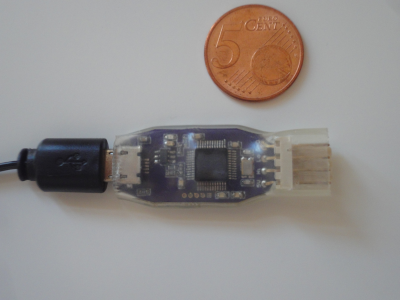
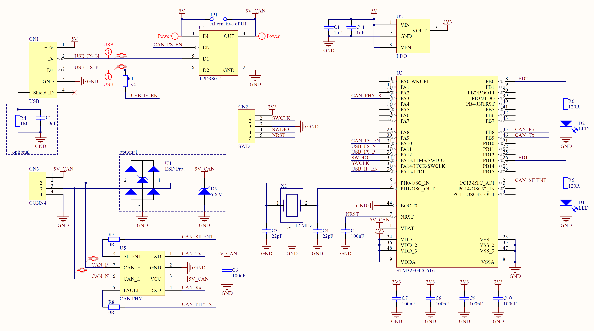

# CanDybug 

This repository contains the embedded firmware of the CanDybug,
a CAN bus traffic analizer which uses a custom protocol over a USB serial port emulation.

## Features

- Transmit and receive CAN 2.0A/B (ISO-11898) frames
- Full-speed USB 2.0 device
- Efficient USB transfer format allows high speed CAN operation with minimal latency
- CAN transceiver can be supplied externally via 5V pin or from USB through power switch
- Supports USB firmware upgrade
- Can be interfaced as a serial port
- Using [USBDevice][USBDevice] the interface can be effortlessly integrated or duplicated in a composite USB device
- Cost-effective hardware: PCB is only 30 x 15 mm, low component count

## USB Communication Protocol

The device appears as a standard virtual COM port (CDC-ACM with vendor-specific protocol) when connected to a host machine. 
The setup of the interface is done through control requests, 
while the bus activity is communicated through the dedicated data endpoints.

### CAN bus setup

Setting up the CAN bus parameters is analogical to the serial port setup. The same request format is used
(get = 0x21, set = 0x20), but the interpretation of certain values is changed for this application.

Data = {dwBaudrate (4), bTrcvPwr */Stop bit/* (1), bTestMode */Parity/* (1), bDataBits (1)}

1. **dwBaudrate** baudrate of the CAN bus in bit/s (bit timing is calculated internally)
2. **bTrcvPwr** when set, connects USB 5V to the on-board CAN transceiver
3. **bTestMode** 0 for normal operation, 1 for loopback 
4. **bDataBits** read-only, returns 64

### Data pipe packets

The bidirectional data channel has a specific message format.
The first byte is always the total length of the message (including the length byte).
The second byte is the message type, and the rest is type dependent, as shown in the table below:

| Length | Code | Message type             | Payload |
|:------:|:----:|:-------------------------|:--------|
| 4..12  | 0x00 | CAN standard data frame  | {2 byte ID; 0..8 byte data} |
| 4      | 0x02 | CAN standard RTR frame   | {2 byte ID} |
| 6..14  | 0x04 | CAN extended data frame  | {4 byte ID; 0..8 byte data} |
| 6      | 0x06 | CAN extended RTR frame   | {4 byte ID} |
| 3      | 0x40 | CAN bus error            | {1 byte error info} |
| 2      | 0x8# | CAN frame sent by device | {} |

The last two types are only sent by the device, the others are both sent by the hostto initiate a CAN frame transmission on the bus and by the device when it read a CAN frame from the bus.
The frames are always transmitted in the order they are sent to the device.

## Hardware design

The PCB with its respective BOM is available on [OSHPark][OSHPark].

## External dependencies

This firmware uses [DFU bootloader][DfuBootloader],
which is built for this target with the following parameters:

`TARGET_HEADER="\<stm32f040x6.h\>" SERIES=STM32F0 FLASH_APP_ADDRESS=0x08002000, FLASH_APP_SIZE=24*1024, FLASH_TOTAL_ERASE_TIME_ms=480, USBD_VID=0xFFFF, USBD_PID=0xF042, VDD_VALUE_mV=3300`

For a standalone operation the DFU interface must not be mounted on the application USB device,
and the application flash offset has to be removed.

Built with GCC ARM tools.

[OSHPark]: https://oshpark.com/shared_projects/jVh7PNHF
[STM32_XPD]: https://github.com/IntergatedCircuits/STM32_XPD
[USBDevice]: https://github.com/IntergatedCircuits/USBDevice
[DfuBootloader]: https://github.com/IntergatedCircuits/DfuBootloader
